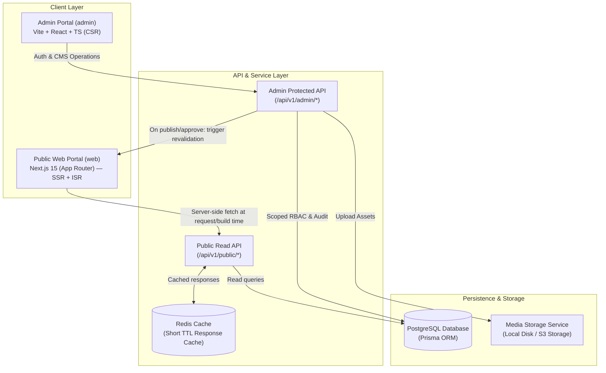
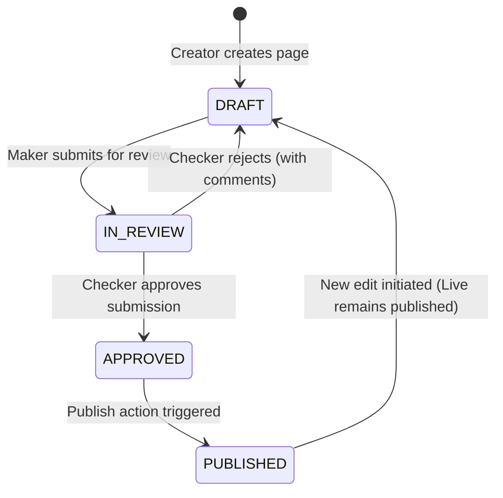

# MahaPrisons Website — CMS Architecture Plan

| Attribute | Details |
| :--- | :--- |
| **Project** | MahaPrisons Public Web (`web`) + Admin Portal (`admin`) + Backend API (`backend`) |
| **Department** | Maharashtra Prisons & Correctional Services Department |
| **Date** | 1 September 2026 |
| **Version** | 1.0.0 (Architecture Baseline) |
| **Target Goal** | 100% dynamic CMS-driven content management (Zero code changes / redeploys for content updates) |

---

> [!IMPORTANT]
> **Core Architectural Objective**
> Every piece of content on the public site — including every page, mega-menu link, site chrome (header, footer, topbar, news ticker), image asset, and bilingual (Marathi/English) string — must become fully editable from the Admin Portal with zero manual code modifications or deployment pipelines required.

---

## System Overview & Architecture Flow



---

## 1. Current State (As-Is Analysis)

The public application (`web/`) operates as a pure client-side React 19 + Vite Single Page Application. The `admin/` and `backend/` modules currently consist of blueprint documentation without executable backend integration.

> [!IMPORTANT]
> **Framework Decision: `web/` migrates to Next.js (App Router)**
> The public site's routing is being rebuilt regardless (§6) to go from 40+ static routes to a dynamic, CMS-driven `PageRenderer`. Doing that rebuild in **Next.js instead of staying on Vite/CSR** is the same-sized migration done once, not twice — it resolves the CSR crawlability/SEO gap already flagged in `docs/GIGW-COMPLIANCE-AUDIT.md` at the same time, instead of retrofitting SSR as a separate later phase. `admin/` stays Vite + React (CSR) — it's an authenticated, interactive, non-indexed app; Next.js buys nothing there.

Currently, all application content is hardcoded across static JavaScript and JSON files bundled at build time:

| Content Domain | Storage Location | Data Structure & Mechanics |
| :--- | :--- | :--- |
| **Navigation Menu** | `web/src/data/mockData.js` → `navigation_menu` | Nested array structure containing `{ text, icon, href, title, children[], groups[] }` |
| **Site Chrome** | `web/src/data/mockData.js` → `mockHomepageData` | Flat object storing header branding, topbar utilities, contact details |
| **Application Routing** | `web/src/App.jsx` | 40+ hardcoded `<Route>` declarations |
| **Bilingual UI Strings** | `web/src/data/translations.js` | Keyed object mapping `"मराठी key": { mr, en }` |
| **Administrative Pages** | `web/src/data/administrativeData.js` | Object mapping `{ [dataId]: { title: {mr, en}, sections: [...] } }` rendered by templates |
| **Departmental Pages** | `agricultureData.js`, `facilitiesData.js`, `socialActivitiesData.js` | Standardized `{ mr, en }` template data structures |
| **Media & Gallery** | `galleryData.js` | Static lists of imported image assets |
| **Homepage Content** | `mockData.js` + `extracted_homepage_data.json` | Bespoke section data arrays and objects |

> [!NOTE]
> **Key Architectural Insight**
> Most inner pages currently render using four standardized layout templates (`TemplateA` through `TemplateD`) keyed by a `dataId`.
> 
> ```jsx
> // Example: AdministrationPage.jsx
> export const AdministrationPage = () => <TemplateA dataId="administration" />;
> ```
> 
> `TemplateA` looks up `administrativeData[dataId]` and renders translation wrappers such as `getTranslation(data.title)`. **This architecture is already ~80% aligned with a CMS document shape.** Transitioning to a true CMS requires moving this data structure from bundled JS objects to database records fetched dynamically by route slug.

---

## 2. System Scope: "Everything Editable"

The CMS scope encompasses the full lifecycle management of all website content elements:

1. **Navigation Tree**: Every level of navigation (top bar, mega-menu headers, nested links, labels in Marathi/English, icons, targets, order index, visibility toggles).
2. **Page Registry**: Every route path becomes a database-backed page with title, template selection, ordered content blocks, status lifecycle, and slug mapping.
3. **Site Chrome & Identity**: Header logos, branding text, topbar links, footer navigation, accessibility toolbar options, marquee news ticker, and dynamic sitemap.
4. **Homepage Modules**: Hero carousel, about section, notices & tenders tabs, holiday calendar, quick e-services, leadership profiles, jail stats grid, photo gallery.
5. **Media Asset Management**: Centralized media library replacing hardcoded repo assets with uploaded media and mandatory bilingual alt text.
6. **Bilingual String Registry**: Master translation dictionary for all global UI labels, button text, and system messages.
7. **Structured Content Collections**: Dedicated CRUD modules for Announcements/Tenders, Inmate Products catalog, Facility Officer rosters, and Gallery Albums.
8. **Global Site Configuration**: Master settings for official contact information, social links, government department metadata, and GIGW ownership attributes.

> [!TIP]
> **Design Consistency & Compliance Strategy**
> Rather than building an unconstrained drag-and-drop page builder, the system utilizes a **Fixed Template + Typed Content Block** pattern. This preserves strict design guidelines and GIGW 3.0 government accessibility compliance while granting total content autonomy to department editors.

---

## 3. Content Model & Database Schema

The database persistence layer is built on **PostgreSQL** managed via **Prisma ORM**.

### 3.1 Core CMS Tables

```prisma
model Template {
  key                 String   @id // "TemplateA" | "TemplateB" | "TemplateC" | "TemplateD" | "Homepage"
  name                String   // Display name in admin template picker
  thumbnailMediaId    String?  @db.Uuid
  allowedBlockTypes   String[] // Whitelist e.g. ["hero", "stat_grid", "officer_list"]
  slotRules           Json?    // Operational constraints: { hero: { min: 1, max: 1 } }
  
  pages               Page[]
  thumbnail           Media?   @relation(fields: [thumbnailMediaId], references: [id])
}

enum PageStatus {
  DRAFT
  IN_REVIEW
  APPROVED
  PUBLISHED
  REJECTED
  ARCHIVED
}

model Page {
  id            String     @id @default(uuid()) @db.Uuid
  slug          String     @unique // e.g. "administrative/administration"
  menuItemId    String?    @db.Uuid
  templateKey   String
  status        PageStatus @default(DRAFT)
  titleMr       String
  titleEn       String
  meta          Json?      // SEO, GIGW review date, ownership metadata
  createdBy     String     @db.Uuid
  updatedBy     String     @db.Uuid
  createdAt     DateTime   @default(now())
  updatedAt     DateTime   @updatedAt
  publishedAt   DateTime?

  template      Template       @relation(fields: [templateKey], references: [key])
  menuItem      MenuItem?      @relation(fields: [menuItemId], references: [id])
  blocks        ContentBlock[]
  versions      PageVersion[]
  creator       User           @relation("PageCreator", fields: [createdBy], references: [id])
  updater       User           @relation("PageUpdater", fields: [updatedBy], references: [id])
}

model ContentBlock {
  id        String   @id @default(uuid()) @db.Uuid
  pageId    String   @db.Uuid
  blockType String   // Validated against Page.template.allowedBlockTypes
  order     Int      // Sequence index within page layout
  data      Json     // Schema-validated component parameters
  createdAt DateTime @default(now())
  updatedAt DateTime @updatedAt

  page      Page     @relation(fields: [pageId], references: [id], onDelete: Cascade)
}

enum DecisionStatus {
  PENDING
  APPROVED
  REJECTED
}

model PageVersion {
  id             String         @id @default(uuid()) @db.Uuid
  pageId         String         @db.Uuid
  blocksSnapshot Json           // ContentBlock[] state snapshot at submission
  submittedBy    String         @db.Uuid
  submittedAt    DateTime       @default(now())
  reviewedBy     String?        @db.Uuid
  reviewedAt     DateTime?
  decision       DecisionStatus @default(PENDING)
  comments       String?        // Checker rejection rationale or approval notes

  page           Page           @relation(fields: [pageId], references: [id], onDelete: Cascade)
  submitter      User           @relation("VersionSubmitter", fields: [submittedBy], references: [id])
  reviewer       User?          @relation("VersionReviewer", fields: [reviewedBy], references: [id])
}

model MenuItem {
  id           String     @id @default(uuid()) @db.Uuid
  parentId     String?    @db.Uuid
  labelMr      String
  labelEn      String
  href         String     // Internal slug or external URL
  pageId       String?    @db.Uuid
  icon         String?    // Lucide icon name
  order        Int
  isMegaGroup  Boolean    @default(false)
  visible      Boolean    @default(true)
  createdAt    DateTime   @default(now())
  updatedAt    DateTime   @updatedAt

  parent       MenuItem?  @relation("MenuHierarchy", fields: [parentId], references: [id])
  children     MenuItem[] @relation("MenuHierarchy")
  page         Page[]
}

model Translation {
  id        String   @id @default(uuid()) @db.Uuid
  key       String   @unique
  mr        String
  en        String
  namespace String   @default("global")
}

model Media {
  id         String   @id @default(uuid()) @db.Uuid
  filename   String
  url        String
  altMr      String
  altEn      String
  uploadedBy String   @db.Uuid
  createdAt  DateTime @default(now())

  uploader   User     @relation(fields: [uploadedBy], references: [id])
  templates  Template[]
}

model SiteSettings {
  id            String @id @default(uuid()) @db.Uuid
  logoH1        String
  logoSpans     Json
  topbarLinks   Json
  footerColumns Json
  contactInfo   Json
  socialLinks   Json
}
```

### 3.2 Collection Tables (Structured Data Models)

```prisma
model Announcement {
  id          String   @id @default(uuid()) @db.Uuid
  titleMr     String
  titleEn     String
  category    String   // "notice" | "tender" | "recruitment"
  pdfMediaId  String?  @db.Uuid
  publishDate DateTime
  validUntil  DateTime?
  status      PageStatus @default(DRAFT)
}

model Product {
  id            String   @id @default(uuid()) @db.Uuid
  nameMr        String
  nameEn        String
  category      String
  descriptionMr String
  descriptionEn String
  price         Decimal? @db.Decimal(10, 2)
  images        Json
  jailUnit      String
  stockStatus   String   @default("AVAILABLE")
}

model Facility {
  id            String   @id @default(uuid()) @db.Uuid
  nameMr        String
  nameEn        String
  category      String
  descriptionMr String
  descriptionEn String
  officers      Json
  pageId        String?  @db.Uuid
}

model Officer {
  id            String   @id @default(uuid()) @db.Uuid
  nameMr        String
  nameEn        String
  designationMr String
  designationEn String
  photoMediaId  String?  @db.Uuid
  department    String
  order         Int
}
```

---

### 3.3 Authorization & Scoped Governance Workflow

The administration portal implements a **Scoped Role-Based Access Control (RBAC)** architecture paired with a formal **Maker-Checker Workflow**.



#### Scoped Access Control Architecture

Users are assigned scoped menu permissions that determine where they can execute modifications:

```prisma
model UserMenuPermission {
  id         String   @id @default(uuid()) @db.Uuid
  userId     String   @db.Uuid
  menuItemId String   @db.Uuid
  canWrite   Boolean  @default(false) // Maker: Create, edit, submit drafts
  canApprove Boolean  @default(false) // Checker: Approve, reject, publish

  user       User     @relation(fields: [userId], references: [id])
  menuItem   MenuItem @relation(fields: [menuItemId], references: [id])
}
```

#### Operational Workflow Breakdown

> [!WARNING]
> **Governance Policy**
> High-consequence, public-facing structural items require mandatory dual-authorization (Maker-Checker approval). Routine, operational content modifications use direct-write scoped authorization with automated audit logging.

| Content Type / Action | Governance Model | Operational Rationale |
| :--- | :--- | :--- |
| **Page Publication** | **Maker-Checker Gated** | Public legal responsibility and GIGW compliance validation. |
| **Notices & Tenders** | **Maker-Checker Gated** | Prevents unauthorized or inaccurate public tender releases. |
| **Navigation Structure** | **Maker-Checker Gated** | Structural navigation changes impact site-wide routing. |
| **Site Settings** | **Maker-Checker Gated** | Global identity and official contact attributes. |
| **Navigation Relabeling** | Direct Write (Scoped) | Purely cosmetic text fixes; low risk, easily reverted. |
| **Translations Dictionary** | Direct Write (Scoped) | High-frequency string polish and typographic adjustments. |
| **Media Uploads** | Direct Write (Scoped) | Media is non-public until referenced in gated content. |
| **Gallery & Officer Rosters** | Direct Write (Scoped) | Operational routine department assets. |
| **Products Catalog** | Direct Write (Scoped) | Rapid inventory and showcase catalog updating. |

---

## 4. Component & Content Block Registry

Content blocks are defined in a unified frontend registry shared by the public renderer (`web`) and the administrative form builder (`admin`).

```typescript
// Shared Component Registry Contract
export const blockRegistry = {
  hero: {
    component: HeroBlock,
    schema: z.object({
      title_mr: z.string().max(80),
      title_en: z.string().max(100),
      subtitle_mr: z.string().max(160).optional(),
      subtitle_en: z.string().max(200).optional(),
      image_media_id: z.string().uuid(),
    }),
  },
  richtext: { component: RichTextBlock, schema: richtextSchema },
  officer_list: { component: OfficerListBlock, schema: officerListSchema },
  stat_grid: { component: StatGridBlock, schema: statGridSchema },
  gallery: { component: GalleryBlock, schema: gallerySchema },
  table: { component: TableBlock, schema: tableSchema },
  cta: { component: CtaBlock, schema: ctaSchema },
};
```

> [!TIP]
> **Strict Layout Protection**
> Every block input schema enforces character limits (`maxLength`) matching exact design CSS bounds (line-clamp, grid cell heights). Form inputs block excess text client-side while backend Zod schemas validate server-side, preventing broken UI layouts.

---

## 5. API Specification Blueprint

### Public Endpoints (`/api/v1/public/*`) — Unauthenticated & Redis Cached

- `GET /pages/:slug` — Retrieves full page data with ordered block array.
- `GET /menu` — Returns complete hierarchical `MenuItem` tree.
- `GET /translations` — Returns key-value translation map `{ [key]: { mr, en } }`.
- `GET /settings` — Returns global `SiteSettings` singleton.
- `GET /announcements?category=` — Lists active announcements, notices, and tenders.
- `GET /products` — Lists inmate products catalog with availability status.
- `GET /gallery` — Returns structured photo gallery albums.

### Admin Endpoints (`/api/v1/admin/*`) — Authenticated & Scoped RBAC

#### Gated Maker-Checker Routes
- `POST /pages/:id/submit-for-review` — Creates version snapshot, updates status to `IN_REVIEW`.
- `POST /pages/:id/approve` — Checker approves submission, transitions status to `PUBLISHED`.
- `POST /pages/:id/reject` — Checker rejects submission with required review comments.
- `GET /review-queue` — Lists pending items in checker's authorized scope.

#### Direct-Write Scoped Routes
- `PUT /translations/:id` — Updates bilingual string translation entry.
- `POST /media/upload` — Multipart file upload creating media asset row.
- `PUT /gallery/:id` | `PUT /officers/:id` | `PUT /products/:id` — Standard CRUD management.
- `PUT /menu/:id` — Relabels navigation labels or order index.

#### Revalidation Webhook (drives Next.js ISR)

- `POST /api/revalidate` (called by `backend`, not by the browser) — hosted on `web`'s Next.js app, protected by a shared secret. `backend` calls this on every event that changes public content: `pages/:id/approve`, `menu` structural approve, `settings` update, and every direct-write mutation (translation, gallery, officer, product, menu relabel). Payload: `{ path: "/administrative/administration" }` or `{ tag: "menu" }` / `{ tag: "translations" }` for cross-cutting data. Internally calls Next's `revalidatePath`/`revalidateTag` — the affected page regenerates and serves fresh on the very next request, no cache TTL wait.

---

## 6. Frontend Architecture Rework (`web/` → Next.js)

`web/` is rebuilt as a Next.js (App Router) project — replacing `react-router-dom` and the Vite CSR shell, not layered on top of them.

1. **Dynamic Routing Engine**: 40+ explicit `App.jsx` routes collapse into one dynamic catch-all Server Component route:
   ```
   app/[[...slug]]/page.tsx
   ```
   The Server Component reads `params.slug`, calls the public API server-side (`fetch(...)`, no client round-trip needed for first paint), and renders the matching `Template{A-D}` with its `ContentBlock[]` — same template components as today, now fed by a server fetch instead of a static import.
2. **Rendering & Freshness Strategy**: Pages render via **ISR** (`export const revalidate = ...` as a safety-net TTL) **plus on-demand revalidation** — the admin backend calls the `/api/revalidate` webhook (§5) on publish/approve/direct-write, so a page updates immediately rather than waiting on any TTL. No rebuild/redeploy ever required for a content change — the core CMS requirement — while every visitor and every crawler gets fully-rendered HTML.
3. **Dynamic Menu System**: `MegaMenu` becomes a Server Component fetching `/api/v1/public/menu` at render time (revalidated via the `menu` tag on webhook), wrapped by a small Client Component only for the interactive open/close/hover state — data fetching itself doesn't need to be client-side anymore.
4. **Global Translation Context**: `useAccessibility()`'s translation map is fetched server-side once per request (or cached via `revalidateTag('translations')`) and passed down, rather than fetched client-side after mount — removes the current flash-of-Marathi-keys-before-translation-loads risk entirely.
5. **Legacy Data Retirement**: Transition existing data files (`mockData.js`, `administrativeData.js`, etc.) into database seed scripts before removal from the repository bundle.
6. **Library compatibility**: `framer-motion` and `lucide-react` both work in Next.js Client Components unchanged (mark components using hooks/animation/interactivity `"use client"`). `` tags can stay as-is initially; migrating to `next/image` is a nice-to-have, not required for this plan.
7. **No separate SSR phase needed later**: because SSR/ISR ship as part of this rework (Phase 3), the GIGW crawlability gap is closed here — there is no follow-up "Phase 7" retrofit.

---

## 7. Admin Portal Information Architecture (`admin/`)

```text
Admin Dashboard
├── Overview & Analytics (Pending Drafts, Review Queue, GIGW Status, System Health)
├── Navigation Builder (Tree View, Relabeling, Structural Hierarchy Setup)
├── Page Management
│   ├── Page Roster (Filtered by menu scope and status)
│   ├── Block Editor (Meta setup, Whitelisted Block Picker, Zod Live Validator)
│   └── Review Queue (Diff Viewer, Approval & Rejection Actions)
├── Content Collections
│   ├── Announcements & Tenders (Gated PDF upload & metadata form)
│   ├── Inmate Products Catalog (Direct Write Inventory & Showcase)
│   ├── Department Officers (Staff Roster & Assignment)
│   └── Photo Gallery (Album & Image Management)
├── Media Library (File uploader, Alt Text Editor, Usage Tracker)
├── Translation Dictionary (Searchable Key-Value Matrix)
├── Site Settings (Global Branding, Topbar, Footer, Contact info)
├── User & Access Control (Super Admin RBAC & Subtree Permission Grid)
└── System Audit Logs (Action history, IP, Diff Inspector)
```

---

## 8. Implementation & Migration Phases

| Phase | Milestone Title | Primary Deliverables & Operational Focus |
| :---: | :--- | :--- |
| **Phase 0** | Core Infrastructure | Init `backend` & `admin` packages, init `web/` as Next.js, Docker Postgres+Redis setup, env variables. |
| **Phase 1** | Database & Seeding | Execute Prisma migrations, run legacy data parsing seed script. |
| **Phase 2** | Public Read API | Construct `/api/v1/public` endpoints with Redis caching middleware. |
| **Phase 3** | Frontend Integration | Rebuild `web/` on Next.js App Router: dynamic `[[...slug]]` route, Server Component data fetch, ISR + on-demand `/api/revalidate` webhook. SSR/SEO ships here, not as a later phase. |
| **Phase 4** | Auth & Governance API | Build JWT auth, RBAC middlewares, Maker-Checker review queue routes, call `/api/revalidate` on every publish/approve/direct-write. |
| **Phase 5** | Admin Portal Interface | Build Admin UI (Navigation Builder, Block Form Builder, Review Queue, Media Library) — Vite + React (CSR), unchanged. |
| **Phase 6** | Security & Compliance | XSS sanitization, CORS lockdown, rate limiting, GIGW audit re-assessment. |

---

## 9. Stakeholder Decision Register

- **Infrastructure & Database Hosting**: Determine self-hosted PostgreSQL/Redis cluster versus government-managed cloud infrastructure.
- **Media Asset Storage**: Select local storage mount, S3 object storage, or NIC-provided media infrastructure.
- **User Directory Seed**: Establish initial administrator accounts and departmental scope mapping (`UserMenuPermission`).
- **Hosting for Next.js `web/`**: Confirm target hosting supports Next.js server runtime (Node server, or platforms like Vercel/self-hosted Node) rather than pure static hosting — required for ISR/on-demand revalidation to function. Flag to whoever owns govt hosting/NIC infra early, as it may constrain the "self-hosted vs managed" decision above.
