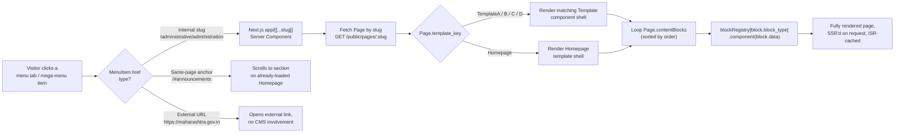
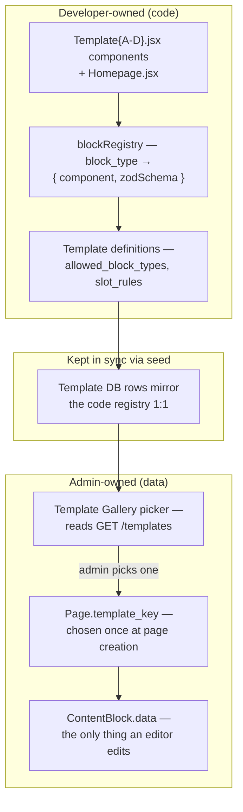
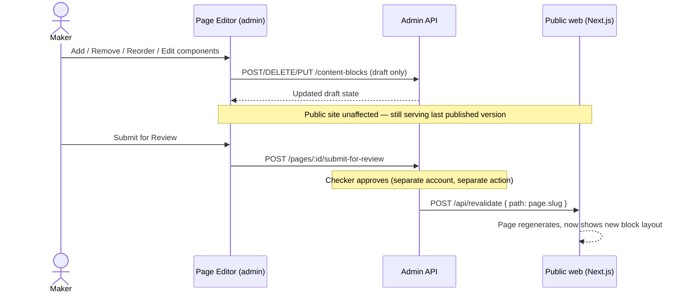

# MahaPrisons CMS — Frontend Rendering & Admin Editing Architecture

| Attribute | Details |
| :--- | :--- |
| **Scope** | Frontend-only: how the public site (`web/`, Next.js) renders menu tabs into pages/templates, and how the admin portal (`admin/`) manages templates, primary pages, and page components. |
| **Companion docs** | [`CMS-ARCHITECTURE-PLAN.md`](./CMS-ARCHITECTURE-PLAN.md) (full data model, backend, permissions) · [`CMS-IMPLEMENTATION-PLAN.md`](./CMS-IMPLEMENTATION-PLAN.md) (build phases) |
| **Date** | 1 September 2026 |

---

## 1. Rendering Model — Menu Drives Everything

There is no separate "route table" anymore. The **menu tree is the site's route table**. Every tab a visitor clicks resolves through the same pipeline:



**Three kinds of menu targets exist today** (visible in the current `navigation_menu` data — this is not new, it's how the site already works, the CMS just makes each part editable):

| Target type | Example (current data) | CMS handling |
|---|---|---|
| **Page-linked tab** | `कारागृह व्यवस्था` → `/yerawada-open-jail`; `प्रशासकीय विभाग` → each dept item → `/administrative/administration` | `MenuItem.page_id` set, `href` = the `Page.slug`. Resolves through the dynamic route pipeline above. |
| **Same-page anchor** | Home's children: `/#about`, `/#announcements`, `/#calendar`, `/#gallery`, `/#services` | `MenuItem.page_id` is **null**, `href` stays a `#fragment`. These are not separate pages — they're anchors into the Homepage's own section blocks. Admin can't "edit a page" for these; editing them means editing the corresponding Homepage `ContentBlock` (see §3). |
| **Mega-menu group header** | `प्रशासकीय विभाग`'s group titles like "प्रशासन व कर्मचारी" | `is_mega_group = true`, not clickable itself, purely a visual grouping node above its `children[]`. No page, no href resolution. |
| **External link** | Topbar's `https://www.maharashtra.gov.in` | `href` is a full URL. Rendered as a plain `<a>`, opens outside the CMS entirely — nothing to manage beyond the URL/label text itself (lives in `SiteSettings.topbar_links`, not `MenuItem`). |

The admin's Menu Builder (per `CMS-ARCHITECTURE-PLAN.md` §7) surfaces all four types in the same tree UI but shows different edit affordances per type — a same-page-anchor node's "edit" opens the Homepage block editor at that section, not a Page editor; an external-link node's "edit" is just label+URL text fields.

---

## 2. Primary Pages vs Regular Pages

Not every page is equal. Two are structurally special: **Home** and **About Us** (and by extension any other single, load-bearing page like Contact Us, Sitemap — GIGW-mandated pages per `GIGW-COMPLIANCE-AUDIT.md`).

### 2.1 What makes a page "primary"

```prisma
model Page {
  // ...existing fields (see CMS-ARCHITECTURE-PLAN.md §3.1)
  isPrimary   Boolean  @default(false)   // NEW: marks Home, About Us, Contact Us, etc.
}
```

- `isPrimary = true` pages **cannot be deleted** from the admin UI (delete button hidden/disabled, backend rejects the request even if attempted directly).
- Their `slug` is **locked** after creation (`/` for Home, `/about-us` for About Us) — editing slug on a primary page would break the entire menu structure and any bookmarked/indexed URLs, so the admin form renders it read-only, not just discouraged.
- They can still be unpublished/edited/content-changed like any page — "primary" only protects existence + URL, not content.
- The Page Manager (admin) **pins primary pages to the top of the list**, visually separated from the regular page roster, so editors always know where Home/About Us are without hunting through the tree.

### 2.2 Home is further special: it's not template-driven

Every other page (`TemplateA–D`) is a generic template rendering a generic block list. **Homepage is its own template type** (`template_key = "Homepage"`) because its layout is bespoke — hero carousel, news ticker, announcements tabs, holiday calendar, minister profiles, jail insights stats, photo gallery — sections that don't exist anywhere else on the site.

```
Template(key="Homepage")
  allowed_block_types: [
    "hero_carousel", "news_ticker", "about_section", "announcements_tabs",
    "holiday_calendar", "quick_services", "minister_profiles",
    "jail_insights_stats", "photo_gallery"
  ]
  slot_rules: { hero_carousel: {min:1,max:1}, news_ticker: {min:0,max:1}, ... }
```

Same mechanics as any other template (§3 below) — add/remove/reorder from a whitelist, fixed component code, editable `data` only — just a whitelist unique to the homepage. This also explains the anchor-link behavior in §1: `/#announcements` scrolls to wherever the `announcements_tabs` block currently sits in the Homepage's block order — if an editor moves that block, the anchor still lands on it correctly since it's an `id` on the rendered section, not a fixed page position.

### 2.3 About Us — a regular template, just protected

Unlike Home, About Us has no unique layout requirement — it's a title + rich text + maybe an officer/leadership block. It uses a normal template (e.g. `TemplateB`) like any departmental page. The only difference from a regular page is the `isPrimary` flag (§2.1) — protected from deletion/re-slugging, otherwise edited exactly like `/administrative/administration` or any other page.

---

## 3. Template Management — Admin Selects, Doesn't Create

**Templates are frontend code, not admin-authored data.** This is the boundary that keeps "fixed component, fixed style" true:



- **Adding a new template** (a 5th layout option) is a **developer task**: build the React component, register it + its whitelist in `blockRegistry`/`Template` seed data, deploy. Not something an admin can do from the UI — this is intentional, it's what keeps every page on-brand and GIGW-compliant without a design review on every page creation.
- **Admin's job** is narrower and safer: pick which of the existing templates fits a new page (Template Gallery, thumbnail + name, per `CMS-ARCHITECTURE-PLAN.md` §7), then populate its blocks. `template_key` is locked after page creation (changing template after content exists would orphan blocks that aren't in the new template's whitelist — not allowed).
- If a department genuinely needs a layout no existing template supports, that's a **feature request to the dev team**, resolved by adding a template — same governance as adding a new field to a form elsewhere. This is a deliberate constraint, not a gap: it's what "fixed style" in the original requirement means in practice.

---

## 4. Component (Block) Add / Remove / Reorder — Exact Mechanics

This is the core editable unit. A page is just: **template shell + ordered list of typed blocks**. Here's precisely what happens frontend-side for each action.

### 4.1 Data shape driving the editor

```ts
// What the Page Editor holds in state, straight from GET /admin/pages/:id
type PageDraft = {
  id: string;
  templateKey: "TemplateA" | "TemplateB" | "TemplateC" | "TemplateD" | "Homepage";
  blocks: Array<{
    id: string;
    blockType: string;     // must be in Template.allowedBlockTypes
    order: number;
    data: Record<string, unknown>;  // shape defined by blockRegistry[blockType].schema
  }>;
};
```

### 4.2 Add Component

1. Editor clicks **"+ Add Component"** in the Page Editor's component list.
2. Frontend computes the eligible set: `Template.allowedBlockTypes` **minus** any type already at its `slot_rules.max` (e.g. hides `hero` from the picker once one is already present, if `max: 1`).
3. Editor picks a type from the picker (shown with a small preview thumbnail/label per type, same idea as the Template Gallery).
4. Frontend creates a new block entry, `order = currentMaxOrder + 1`, `data = {}` seeded with each schema field's default (empty string / null), and calls `POST /admin/content-blocks` with `{ pageId, blockType, order, data }`.
5. Backend validates `blockType` against the page's template whitelist (400 if not allowed) and validates `data` against the Zod schema (accepts empty/default-valid state).
6. New block appears at the bottom of the component list, its edit form auto-opens (same generated form as §4.4) so the editor fills content immediately.

### 4.3 Remove Component

1. Editor clicks **Remove** on a block's row → confirm dialog ("This will remove this section from the page. It can be recovered from version history until published.").
2. Frontend calls `DELETE /admin/content-blocks/:id`.
3. Backend soft-deletes (or hard-deletes but the pre-deletion state is already captured — the previous `PageVersion.blocksSnapshot`, if one exists, retains it for recovery/rollback per `CMS-ARCHITECTURE-PLAN.md` §3.3).
4. Backend rejects if this would violate `slot_rules.min` for that type (e.g. can't remove the only `hero` if `min: 1`) — returns 400 with a clear message, frontend surfaces it as a toast instead of removing the row.
5. Component list re-renders without the removed block; remaining `order` values are left as-is (gaps are fine — render always sorts by `order`, doesn't require contiguity).

### 4.4 Edit Component content

1. Editor clicks a block row (or it's already open from Add) → form renders from `blockRegistry[blockType].schema`, auto-generated: one input per field, mr/en pairs shown side-by-side, each text field has a live character counter (`n/maxLength`) that **hard-stops** further typing at the limit (not just a warning).
2. Image fields open the Media Library picker (existing `Media` rows, or upload-new inline) instead of a text input.
3. Save writes `PUT /admin/content-blocks/:id` with the updated `data` object; backend re-validates the full Zod schema before persisting.
4. **Style is never touched here.** The form only ever produces a `data` JSON object — no field for CSS class, layout, color, or markup exists anywhere in this flow. The block's React component (`blockRegistry[blockType].component`) owns 100% of how that `data` renders; two pages using the same block type always look identical in structure, differing only in the text/images plugged in.

### 4.5 Reorder Components

1. Editor drags a block row up/down in the component list (`@dnd-kit` or similar).
2. On drop, frontend recomputes `order` for the affected range and calls `PUT /admin/content-blocks/reorder` with a batch `[{id, order}, ...]` payload — one request, not N requests.
3. List re-renders in the new order immediately (optimistic update), backend confirms/corrects if conflict.

### 4.6 Where this sits in the maker-checker flow

All of §4.2–4.5 happen against the page's **current draft** — freely, no approval needed to *experiment*. Per `CMS-ARCHITECTURE-PLAN.md` §3.4c, Pages are a **gated** content type: none of these add/remove/edit/reorder actions affect the *live* public site until the maker hits **Submit for Review** and a checker **Approves**. Until then, the public `web` continues serving the last-published `PageVersion` — the draft-in-progress is only visible in the admin's Preview pane (an iframe rendering the draft state via a preview-only API endpoint that bypasses the published-only filter).



---

## 5. Summary — What's Fixed vs What's Editable

| Layer | Owner | Editable via admin? |
|---|---|---|
| Which templates exist, their whitelist/slot rules | Developer (code) | No |
| A block type's React component (markup, CSS, animation) | Developer (code) | No |
| A block type's field schema (which fields exist, their `maxLength`) | Developer (code) | No |
| Menu tree structure (add/remove/nest items) | Admin, gated (checker approval) | Yes |
| Menu item label/order (cosmetic) | Admin, direct-write | Yes |
| Which template a page uses | Admin, chosen once at creation, locked after | Yes (at creation only) |
| Which components are on a page, their order | Admin, gated (checker approval to go live) | Yes |
| A component's text/image content | Admin, gated (checker approval to go live) | Yes |
| Existence/slug of Home, About Us (primary pages) | Locked — not deletable, slug not editable | No |
