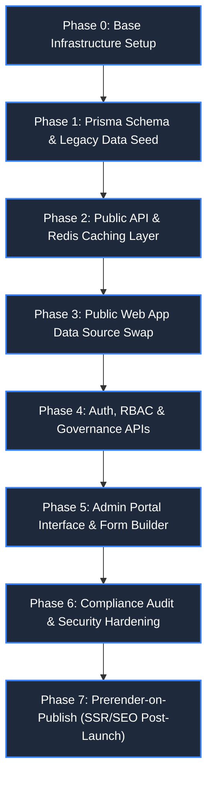
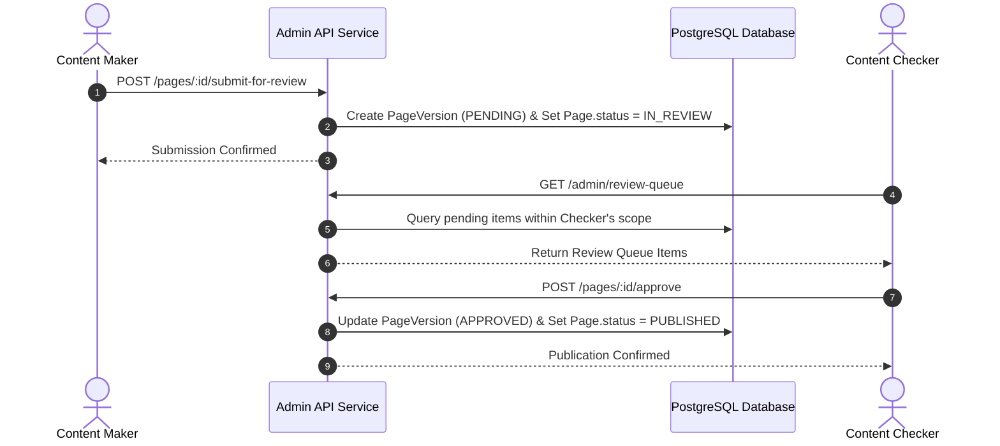

# MahaPrisons CMS — Step-by-Step Implementation Plan

| Attribute | Details |
| :--- | :--- |
| **Project** | MahaPrisons CMS Implementation Roadmap |
| **Companion Architecture** | [`CMS-ARCHITECTURE-PLAN.md`](./CMS-ARCHITECTURE-PLAN.md) |
| **Target System** | Public Web Portal (`web`) + Admin Dashboard (`admin`) + API Service (`backend`) |
| **Execution Model** | Phased Sequential Delivery (Zero downtime, non-breaking rollout) |
| **Date** | 1 September 2026 |

---

> [!IMPORTANT]
> **Execution Rule**
> Each phase delivers a standalone, fully verified, and deployable milestone. Do not initiate Phase N+1 until Phase N satisfies its strict **Done When Verification Criteria**.

---

## Phase Execution Lifecycle Flow

---

## Phase 0: Base Environment Setup

Initialize project repositories, install dependencies, configure environment settings, and establish local Docker development services.

### Task Checklist

- [ ] Create `backend/package.json` and initialize Node.js application (Express.js).
- [ ] Install core backend dependencies: `prisma`, `@prisma/client`, `express`, `zod`, `jsonwebtoken`, `bcrypt`, `cors`, `helmet`, `express-rate-limit`, `ioredis`.
- [ ] Provision local development containers: PostgreSQL database and Redis server via Docker.
- [ ] Configure `backend/.env` from `.env.example` (`DATABASE_URL`, `REDIS_URL`, `JWT_SECRET`, `CORS_ORIGINS`).
- [ ] Create `docker-compose.yml` for multi-container orchestration (Postgres + Redis + Backend API).
- [ ] Create `admin/package.json`, initialize Vite + React + TypeScript application, install Tailwind CSS v4, React Router, TanStack Query, React Hook Form, Zod, and Radix UI.

> [!TIP]
> **Done When Verification Criteria**
> - Running `docker-compose up` successfully boots PostgreSQL and Redis containers.
> - Running `npm run dev` in `backend/` starts the Express server listening on the configured port.
> - Running `npm run dev` in `admin/` serves the initial Vite single-page application clean without build errors.

---

## Phase 1: Database Schema, Migrations & Legacy Seed

Establish relational database tables, execute initial migrations, and parse existing bundled static JavaScript objects into database rows.

### Task Checklist

- [ ] Draft `backend/prisma/schema.prisma` mapping all core and collection tables specified in Architecture Plan:
  `Template`, `Page`, `ContentBlock`, `PageVersion`, `MenuItem`, `Translation`, `Media`, `SiteSettings`, `Announcement`, `Product`, `Facility`, `GalleryAlbum`, `GalleryImage`, `Officer`, `User`, `UserMenuPermission`, `AuditLog`.
- [ ] Execute `npx prisma migrate dev --name init` to generate baseline migration scripts.
- [ ] Seed initial `Template` entries for `TemplateA` through `TemplateD` and `Homepage`, assigning block type whitelists matching current template JSX components.
- [ ] Build automated legacy migration script `backend/database/seeds/seedFromLegacyData.js`:
  - [ ] Parse `web/src/data/translations.js` and bulk-insert entries into `Translation` table.
  - [ ] Parse `web/src/data/mockData.js` (`navigation_menu`) and recursively seed `MenuItem` tree preserving order and icon references.
  - [ ] Parse `administrativeData.js`, `agricultureData.js`, `facilitiesData.js`, `socialActivitiesData.js` to create `Page` and `ContentBlock` records mapped to current routes.
  - [ ] Parse `galleryData.js` to seed `GalleryAlbum` and `GalleryImage` records.
  - [ ] Copy assets from `web/src/assets` and `web/public` into backend media storage directory, creating corresponding `Media` database records.
  - [ ] Hand-author homepage `Page(slug="/")` content blocks (`HeroCarousel`, `AboutSection`, `AnnouncementsTabs`, `HolidayCalendar`, `QuickServices`, `PhotoGallery`).
  - [ ] Mark all legacy seeded pages with status `PUBLISHED`.
  - [ ] Create initial `SUPER_ADMIN` user account.
- [ ] Run seed pipeline and verify entity row counts against original source data array lengths.

> [!TIP]
> **Done When Verification Criteria**
> - `npm run db:seed` executes cleanly to completion without key constraint failures.
> - Every active route path in `web/src/App.jsx` corresponds to a valid `Page.slug` row.
> - Every navigation link in `mockData.js` has a matching `MenuItem` record.

---

## Phase 2: Public Read API & Response Caching Layer

Expose high-performance, unauthenticated read endpoints for public web consumption with Redis response caching.

### Task Checklist

- [ ] Implement `GET /api/v1/public/pages/:slug`: Fetches published page content and sorted `ContentBlock` array.
- [ ] Implement `GET /api/v1/public/menu`: Returns formatted hierarchical navigation tree.
- [ ] Implement `GET /api/v1/public/translations`: Returns global dictionary object `{ [key]: { mr, en } }`.
- [ ] Implement `GET /api/v1/public/settings`: Returns site configuration singleton record.
- [ ] Implement `GET /api/v1/public/announcements`, `/products`, `/gallery`, `/facilities` list endpoints with category filters.
- [ ] Attach Redis caching middleware across public GET endpoints (60-second TTL for instant cache invalidation).
- [ ] Configure strict CORS whitelist restricted to authorized public web application origins.
- [ ] Validate request parameters using Zod schemas.

> [!TIP]
> **Done When Verification Criteria**
> - All public API endpoints respond with valid JSON formatted data via `curl` tests.
> - Data payloads match exact object shapes expected by public web frontend components.

---

## Phase 3: Public Web Portal Data Source Transition (`web/`)

Transition the public client application from static imported data files to dynamic API endpoints.

### Task Checklist

- [ ] Integrate TanStack Query (React Query) into `web/`.
- [ ] Create `web/src/lib/api.js` API client wrapper configured with `VITE_API_BASE_URL`.
- [ ] Build `PageRenderer.jsx` wildcard dispatcher component to handle dynamic routes based on slug parameters.
- [ ] Refactor `web/src/App.jsx`: Replace 40+ static `<Route>` declarations with `<Route path="/*" element={<PageRenderer />} />`.
- [ ] Update `MegaMenu.jsx`: Replace static data import with dynamic `useQuery(['menu'], fetchMenu)` hook.
- [ ] Update `useAccessibility.jsx`: Hydrate translation context from `/api/v1/public/translations` on application load.
- [ ] Update Homepage components (`HeroCarousel`, `AnnouncementsTabs`, `HolidayCalendar`, `NewsTicker`, `QuickServices`, `MinisterProfiles`, `JailInsights`, `PhotoGallery`) to consume API payloads.
- [ ] Update `Footer.jsx` to fetch dynamic footer links from `/settings`.
- [ ] Implement UI loading, error, and empty state fallbacks across all dynamic components.
- [ ] Perform comprehensive visual QA: Verify rendered pages match original static output pixel-for-pixel.
- [ ] Remove legacy data files (`web/src/data/*.js`) from project build pipeline.

> [!TIP]
> **Done When Verification Criteria**
> - The public site functions dynamically with identical visual output.
> - Temporarily stopping the backend service causes clean UI error states, confirming complete independence from legacy static JS data files.

---

## Phase 4: Authentication, Governance & Scoped Admin API

Implement JWT authentication, role-based access middleware, maker-checker review queue APIs, and direct-write CRUD routes.

### Task Checklist

- [ ] Build Auth endpoints: `POST /api/v1/auth/login`, `/logout`, `/refresh-token` utilizing JWT and HTTP-only cookies.
- [ ] Implement `authMiddleware` for JWT authentication verification.
- [ ] Implement `rbacMiddleware` for coarse role verification (`SUPER_ADMIN`, `CONTENT_EDITOR`, `AUDITOR`).
- [ ] Implement `scopeMiddleware` to enforce fine-grained access checks based on `UserMenuPermission` mapping (`can_write` / `can_approve`).
- [ ] Implement `auditLogger` middleware to record mutating requests to `AuditLog` table with before/after state diffs.
- [ ] Build Template API: `GET /admin/templates` and `GET /admin/templates/:key` (exposing block type whitelists and Zod schemas).
- [ ] Build Gated Governance API routes (Maker-Checker):
  - [ ] `pages`: List, retrieve, draft create/update, submit for review.
  - [ ] `content-blocks`: Create/update/reorder with template whitelist enforcement and Zod validation.
  - [ ] `pages/:id/submit-for-review` (Maker action).
  - [ ] `pages/:id/approve` and `pages/:id/reject` (Checker actions with mandatory comments).
  - [ ] `review-queue`: List pending submissions filtered by caller's authorized checker scope.
  - [ ] `announcements`: Maker-Checker gated lifecycle endpoints.
  - [ ] `menu` structural modifications: Gated add, delete, move, and URL targets.
  - [ ] `settings`: Gated global configuration update routes (`SUPER_ADMIN` + `can_approve`).
- [ ] Build Direct-Write Admin API routes (Scoped `can_write`, live immediately):
  - [ ] `translations`: Translation dictionary CRUD.
  - [ ] `media`: Multipart file upload and media library metadata management.
  - [ ] `gallery`, `officers`, `products`, `facilities`: Direct-write CRUD.
  - [ ] `menu/:id`: Immediate label relabeling and order reindexing.
- [ ] Build System Management routes:
  - [ ] `users`: User administration (Super Admin).
  - [ ] `user-permissions`: Subtree scope permission management grid.
  - [ ] `audit-logs`: Audit log reader with resource and user filtering.
- [ ] Apply rate limiting on authentication routes and sanitize rich-text HTML inputs server-side.

> [!TIP]
> **Done When Verification Criteria**
> - A Maker user can draft content and submit it for review, but is forbidden (403 Forbidden) from self-approving or publishing.
> - A Checker user can view pending submissions in their authorized scope, review diffs, and approve items to publish live.
> - Direct-write endpoints update content immediately while writing comprehensive audit log entries.

---

## Phase 5: Admin Portal User Interface (`admin/`)

Construct the administrative portal web UI featuring navigation management, page building, maker-checker review workflow, and media asset management.

### Task Checklist

- [ ] Build Authentication views: Secure login view, token storage handling, route guards, automatic session timeout.
- [ ] Construct Portal Layout: Responsive sidebar nav dynamically filtered by caller's permissions, header, breadcrumb navigation.
- [ ] Build **Dashboard**: Overview cards, active draft queue, pending review queue counter, recent audit feed.
- [ ] Build **Navigation Tree Builder**:
  - [ ] Direct-write inline label editor and drag-and-drop order reindexing.
  - [ ] Structural modification wizard: Add item -> Optional page auto-creation -> Template selection gallery -> Submit for review queue.
- [ ] Build **Page Manager & Form Builder**:
  - [ ] Page metadata editor (Title, slug, template lock, GIGW review date).
  - [ ] Component roster editor: Add whitelisted components, reorder blocks, remove blocks.
  - [ ] Dynamic component form generator driven by Zod block schemas: Side-by-side Marathi/English fields, **live character counters with hard stops**, media picker.
  - [ ] Save Draft and Submit for Review actions.
- [ ] Build **Review Queue & Diff Viewer**:
  - [ ] Side-by-side block diff visualization comparing submitted `PageVersion` snapshot against live published blocks.
  - [ ] One-click Approve and Reject (with mandatory reviewer notes input).
- [ ] Build **Structured Collections**:
  - [ ] Announcements & Tenders manager with PDF metadata tags (file size, format, language).
  - [ ] Products catalog manager (Jail Industries inventory and image uploads).
  - [ ] Department Officer roster and photo manager.
- [ ] Build **Media Library**: Drag-and-drop file uploader, bilingual alt-text editor, media usage tracker.
- [ ] Build **Translation Dictionary**: Searchable key-value translation grid with live character count indicators.
- [ ] Build **Site Settings Editor**: Master form for site logo, topbar utilities, footer columns, contact details.
- [ ] Build **User Access Manager** (Super Admin): User provisioning and visual permission matrix grid (`can_write` / `can_approve` toggles per menu subtree).
- [ ] Build **Audit Log Viewer**: Filterable log table with detailed diff inspector.

> [!TIP]
> **Done When Verification Criteria**
> - Non-technical department editors can seamlessly update page content, submit items for approval, upload media, and manage navigation without code edits.
> - Layout stability is enforced: Form fields physically prevent typing past character limits, preserving design integrity across all viewports.

---

## Phase 6: Security Hardening & GIGW Compliance Audit

Harden backend infrastructure, enforce security headers, and complete formal compliance validation.

### Task Checklist

- [ ] Enforce HTML sanitization (`sanitize-html`) across all rich-text content inputs server-side prior to storage.
- [ ] Implement CSRF protection mechanisms across admin mutating routes.
- [ ] Lock down CORS headers explicitly to production `web` and `admin` domain origins.
- [ ] Apply API rate limiting middleware across all `/admin/*` and `/auth/*` endpoints.
- [ ] Configure automatic administrative session invalidation after inactivity timeouts.
- [ ] Audit all SQL queries (confirm total parameterization via Prisma ORM).
- [ ] Re-assess `docs/GIGW-COMPLIANCE-AUDIT.md` checklist: Update lifecycle and content management items to **DONE**.
- [ ] Conduct API performance load tests to confirm Redis caching effectively offloads database traffic.
- [ ] Document database backup schedules and disaster recovery procedures.

> [!TIP]
> **Done When Verification Criteria**
> - Penetration testing checks (XSS, SQLi, Auth Bypass, IDOR) pass with zero critical findings.
> - All compliance items in `GIGW-COMPLIANCE-AUDIT.md` marked as requiring CMS integration are fully satisfied.

---

## Phase 7: Post-Launch Enhancements — Prerender-on-Publish (SSR / SEO)

Enhance crawler search engine optimization and accessibility without sacrificing instant CMS publish capabilities.

### Task Checklist

- [ ] Implement automated static HTML snapshot generation triggered upon content publication events.
- [ ] Serve pre-rendered HTML pages directly to search engine bots while hydrating client React applications for users.
- [ ] Validate search engine crawler indexing against rendered page output.

> [!TIP]
> **Done When Verification Criteria**
> - Headless HTTP requests (`curl` without JavaScript execution) receive fully populated HTML content for search engine indexing.
