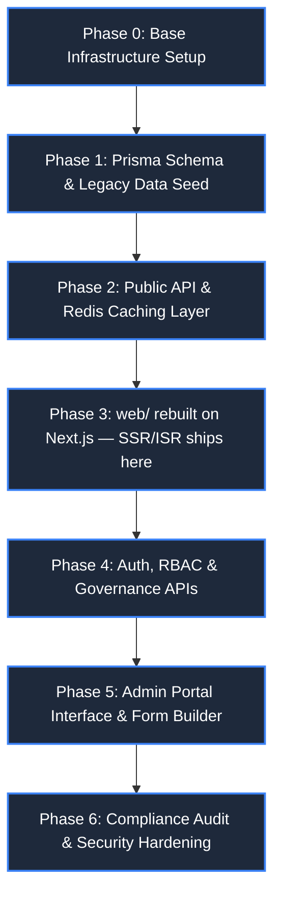
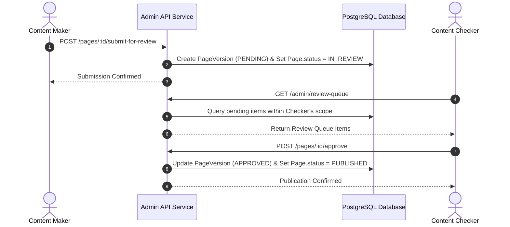

# MahaPrisons CMS — Step-by-Step Implementation Plan

| Attribute | Details |
| :--- | :--- |
| **Project** | MahaPrisons CMS Implementation Roadmap |
| **Companion Architecture** | [`CMS-ARCHITECTURE-PLAN.md`](./CMS-ARCHITECTURE-PLAN.md) |
| **Target System** | Public Web Portal (`web`) + Admin Dashboard (`admin`) + API Service (`backend`) |
| **Execution Model** | Phased Sequential Delivery (Zero downtime, non-breaking rollout) |
| **Date** | 1 September 2026 |

---

> [!IMPORTANT]
> **Execution Rule**
> Each phase delivers a standalone, fully verified, and deployable milestone. Do not initiate Phase N+1 until Phase N satisfies its strict **Done When Verification Criteria**.

---

## Phase Execution Lifecycle Flow

---

## Phase 0: Base Environment Setup

Initialize project repositories, install dependencies, configure environment settings, and establish local Docker development services.

### Task Checklist

- [x] Create `backend/package.json` and initialize Node.js application (Express.js).
- [x] Install core backend dependencies: `prisma`, `@prisma/client`, `express`, `zod`, `jsonwebtoken`, `bcrypt`, `cors`, `helmet`, `express-rate-limit`, `ioredis`.
- [x] Provision local development containers: PostgreSQL database and Redis server via Docker.
- [x] Configure `backend/.env` from `.env.example` (`DATABASE_URL`, `REDIS_URL`, `JWT_SECRET`, `CORS_ORIGINS`).
- [x] Create `docker-compose.yml` for multi-container orchestration (Postgres + Redis + Backend API).
- [x] Create `admin/package.json`, initialize Vite + React + TypeScript application, install Tailwind CSS v4, React Router, TanStack Query, React Hook Form, Zod, and Radix UI.
- [x] Initialize `web/` as a Next.js 15 (App Router, TypeScript optional) project — either `npx create-next-app` fresh and port over existing components/assets/Tailwind config, or add Next.js alongside the current Vite setup and cut over incrementally. Install `framer-motion`, `lucide-react`, `tailwindcss` v4 (same as today).
- [x] Set `web/.env.local` — `NEXT_PUBLIC_API_BASE_URL` (public API), `REVALIDATE_SECRET` (shared secret for the `/api/revalidate` webhook, matches a value `backend/.env` also holds).

> [!TIP]
> **Done When Verification Criteria**
> - Running `docker-compose up` successfully boots PostgreSQL and Redis containers.
> - Running `npm run dev` in `backend/` starts the Express server listening on the configured port.
> - Running `npm run dev` in `admin/` serves the initial Vite single-page application clean without build errors.
> - Running `npm run dev` in `web/` serves a blank Next.js app clean without build errors.

---

## Phase 1: Database Schema, Migrations & Legacy Seed

Establish relational database tables, execute initial migrations, and parse existing bundled static JavaScript objects into database rows.

### Task Checklist

- [x] Draft `backend/prisma/schema.prisma` mapping all core and collection tables specified in Architecture Plan:
  `Template`, `Page`, `ContentBlock`, `PageVersion`, `MenuItem`, `Translation`, `Media`, `SiteSettings`, `Announcement`, `Product`, `Facility`, `GalleryAlbum`, `GalleryImage`, `Officer`, `User`, `UserMenuPermission`, `AuditLog`.
- [x] Execute `npx prisma migrate dev --name init` to generate baseline migration scripts.
- [x] Seed initial `Template` entries for `TemplateA` through `TemplateD` and `Homepage`, assigning block type whitelists matching current template JSX components.
- [x] Build automated legacy migration script `backend/database/seeds/seedFromLegacyData.js`:
  - [x] Parse `web/src/data/translations.js` and bulk-insert entries into `Translation` table.
  - [x] Parse `web/src/data/mockData.js` (`navigation_menu`) and recursively seed `MenuItem` tree preserving order and icon references.
  - [x] Parse `administrativeData.js`, `agricultureData.js`, `facilitiesData.js`, `socialActivitiesData.js` to create `Page` and `ContentBlock` records mapped to current routes.
  - [x] Parse `galleryData.js` to seed `GalleryAlbum` and `GalleryImage` records.
  - [x] Copy assets from `web/src/assets` and `web/public` into backend media storage directory, creating corresponding `Media` database records.
  - [x] Hand-author homepage `Page(slug="/")` content blocks (`HeroCarousel`, `AboutSection`, `AnnouncementsTabs`, `HolidayCalendar`, `QuickServices`, `PhotoGallery`).
  - [x] Mark all legacy seeded pages with status `PUBLISHED`.
  - [x] Create initial `SUPER_ADMIN` user account.
- [x] Run seed pipeline and verify entity row counts against original source data array lengths.

> [!TIP]
> **Done When Verification Criteria**
> - `npm run db:seed` executes cleanly to completion without key constraint failures.
> - Every active route path in `web/src/App.jsx` corresponds to a valid `Page.slug` row.
> - Every navigation link in `mockData.js` has a matching `MenuItem` record.

---

## Phase 2: Public Read API & Response Caching Layer

Expose high-performance, unauthenticated read endpoints for public web consumption with Redis response caching.

### Task Checklist

- [x] Implement `GET /api/v1/public/pages/:slug`: Fetches published page content and sorted `ContentBlock` array.
- [x] Implement `GET /api/v1/public/menu`: Returns formatted hierarchical navigation tree.
- [x] Implement `GET /api/v1/public/translations`: Returns global dictionary object `{ [key]: { mr, en } }`.
- [x] Implement `GET /api/v1/public/settings`: Returns site configuration singleton record.
- [x] Implement `GET /api/v1/public/announcements`, `/products`, `/gallery`, `/facilities` list endpoints with category filters.
- [x] Attach Redis caching middleware across public GET endpoints (60-second TTL for instant cache invalidation).
- [x] Configure strict CORS whitelist restricted to authorized public web application origins.
- [x] Validate request parameters using Zod schemas.

> [!TIP]
> **Done When Verification Criteria**
> - All public API endpoints respond with valid JSON formatted data via `curl` tests.
> - Data payloads match exact object shapes expected by public web frontend components.

---

## Phase 3: Public Web Portal Rebuild on Next.js (`web/`)

Rebuild the public client application on Next.js App Router — replacing both the static data imports **and** `react-router-dom`/Vite CSR in one pass. SSR/ISR and the CSR-crawlability fix ship here; there is no separate later SSR phase.

### Task Checklist

- [x] Port existing components (`components/*.jsx`, `hooks/useAccessibility.jsx`, Tailwind config, `assets/`) into the Next.js project structure (`app/`, `components/`, unchanged internals where possible).
- [x] Mark components that use hooks/animation/browser APIs (`framer-motion`, `useState`, event handlers) with `"use client"` — most current components need this; keep data-fetching itself server-side where possible.
- [x] Create `lib/api.ts` — server-side fetch wrapper for the public API, using `fetch(url, { next: { revalidate: 60, tags: [...] } })` so Next's cache + tag-based revalidation apply automatically.
- [x] Build `app/[[...slug]]/page.tsx` — Server Component: reads `params.slug`, joins to a path/slug, fetches `/api/v1/public/pages/:slug` server-side, selects `Template{A-D}` based on `template_key`, renders with fetched blocks. Replaces both `App.jsx`'s 40+ routes and the previously-planned client-side `PageRenderer`.
- [x] Build `app/page.tsx` for the homepage (`/`) — either same dynamic pattern with `slug=""`, or its own bespoke Server Component if homepage sections stay hand-composed.
- [x] Build `app/api/revalidate/route.ts` — validates `REVALIDATE_SECRET`, accepts `{ path }` or `{ tag }`, calls `revalidatePath`/`revalidateTag`. This is what `backend` calls on every publish/approve/direct-write (wired in Phase 4).
- [x] `MegaMenu` — split into a Server Component (fetches `/api/v1/public/menu`, tag `"menu"`) wrapping a small `"use client"` component that only holds open/hover/mobile-toggle UI state.
- [x] `useAccessibility` — language/translation state fetched server-side (tag `"translations"`) and passed down as initial data; client context only manages the *current selected language* toggle, not the fetch.
- [x] Update Homepage components (`HeroCarousel`, `AnnouncementsTabs`, `HolidayCalendar`, `NewsTicker`, `QuickServices`, `MinisterProfiles`, `JailInsights`, `PhotoGallery`) to receive data as server-fetched props instead of importing static files or fetching client-side.
- [x] Update `Footer.jsx` to receive `SiteSettings` as a server-fetched prop (tag `"settings"`).
- [x] Implement loading/error UI via Next's `loading.tsx` / `error.tsx` route conventions per route segment.
- [x] Perform comprehensive visual QA: verify rendered pages match original static output pixel-for-pixel.
- [x] Remove legacy data files (`web/src/data/*.js` equivalents) from the project once QA passes.
- [x] Retire the old Vite `web/` app (or archive it) once the Next.js version is verified equivalent.

> [!TIP]
> **Done When Verification Criteria**
> - The public site functions dynamically with identical visual output, served via Next.js.
> - Temporarily stopping the backend service causes clean UI error states, confirming complete independence from legacy static JS data files.
> - `curl` against a live page (no JS execution) returns fully-populated HTML — not an empty `
` — proving SSR is actually in effect.
> - Calling `/api/revalidate` with a known `path` updates that page's served content on the very next request, without a rebuild or redeploy.

---

## Phase 4: Authentication, Governance & Scoped Admin API

Implement JWT authentication, role-based access middleware, maker-checker review queue APIs, and direct-write CRUD routes.

### Task Checklist

- [x] Build Auth endpoints: `POST /api/v1/auth/login`, `/logout`, `/refresh-token` utilizing JWT and HTTP-only cookies.
- [x] Implement `authMiddleware` for JWT authentication verification.
- [x] Implement `rbacMiddleware` for coarse role verification (`SUPER_ADMIN`, `CONTENT_EDITOR`, `AUDITOR`).
- [x] Implement `scopeMiddleware` to enforce fine-grained access checks based on `UserMenuPermission` mapping (`can_write` / `can_approve`).
- [x] Implement `auditLogger` middleware to record mutating requests to `AuditLog` table with before/after state diffs.
- [x] Build Template API: `GET /admin/templates` and `GET /admin/templates/:key` (exposing block type whitelists and Zod schemas).
- [x] Build Gated Governance API routes (Maker-Checker):
  - [x] `pages`: List, retrieve, draft create/update, submit for review.
  - [x] `content-blocks`: Create/update/reorder with template whitelist enforcement and Zod validation.
  - [x] `pages/:id/submit-for-review` (Maker action).
  - [x] `pages/:id/approve` and `pages/:id/reject` (Checker actions with mandatory comments).
  - [x] `review-queue`: List pending submissions filtered by caller's authorized checker scope.
  - [x] `announcements`: Maker-Checker gated lifecycle endpoints.
  - [x] `menu` structural modifications: Gated add, delete, move, and URL targets.
  - [x] `settings`: Gated global configuration update routes (`SUPER_ADMIN` + `can_approve`).
- [x] Build Direct-Write Admin API routes (Scoped `can_write`, live immediately):
  - [x] `translations`: Translation dictionary CRUD.
  - [x] `media`: Multipart file upload and media library metadata management.
  - [x] `gallery`, `officers`, `products`, `facilities`: Direct-write CRUD.
  - [x] `menu/:id`: Immediate label relabeling and order reindexing.
- [x] Build `revalidateWebClient.js` helper — calls `web`'s `POST /api/revalidate` (with `REVALIDATE_SECRET`) whenever public content changes. Wire it into: `pages/:id/approve`, `announcements` approve, `menu` structural approve, `settings` update, and every direct-write mutation listed above (translations, media, gallery, officers, products, menu relabel) — each passing the affected `path` or `tag` (`"menu"`, `"translations"`, `"settings"`). Failure to reach `web` logs a warning but does not fail the admin mutation (Next's own TTL fallback still catches it).
- [x] Build System Management routes:
  - [x] `users`: User administration (Super Admin).
  - [x] `user-permissions`: Subtree scope permission management grid.
  - [x] `audit-logs`: Audit log reader with resource and user filtering.
- [x] Apply rate limiting on authentication routes and sanitize rich-text HTML inputs server-side.

> [!TIP]
> **Done When Verification Criteria**
> - A Maker user can draft content and submit it for review, but is forbidden (403 Forbidden) from self-approving or publishing.
> - A Checker user can view pending submissions in their authorized scope, review diffs, and approve items to publish live.
> - Direct-write endpoints update content immediately while writing comprehensive audit log entries.
> - Approving a page (or any direct-write save) triggers `/api/revalidate` on `web`, and the change is visible on the public site within seconds — not the Redis TTL window.

---

## Phase 5: Admin Portal User Interface (`admin/`)

Construct the administrative portal web UI featuring navigation management, page building, maker-checker review workflow, and media asset management.

### Task Checklist

- [x] Build Authentication views: Secure login view, token storage handling, route guards, automatic session timeout.
- [x] Construct Portal Layout: Responsive sidebar nav dynamically filtered by caller's permissions, header, breadcrumb navigation.
- [x] Build **Dashboard**: Overview cards, active draft queue, pending review queue counter, recent audit feed.
- [x] Build **Navigation Tree Builder**:
  - [x] Direct-write inline label editor and drag-and-drop order reindexing.
  - [x] Structural modification wizard: Add item -> Optional page auto-creation -> Template selection gallery -> Submit for review queue.
- [x] Build **Page Manager & Form Builder**:
  - [x] Page metadata editor (Title, slug, template lock, GIGW review date).
  - [x] Component roster editor: Add whitelisted components, reorder blocks, remove blocks.
  - [x] Dynamic component form generator driven by Zod block schemas: Side-by-side Marathi/English fields, **live character counters with hard stops**, media picker.
  - [x] Save Draft and Submit for Review actions.
- [x] Build **Review Queue & Diff Viewer**:
  - [x] Side-by-side block diff visualization comparing submitted `PageVersion` snapshot against live published blocks.
  - [x] One-click Approve and Reject (with mandatory reviewer notes input).
- [x] Build **Structured Collections**:
  - [x] Announcements & Tenders manager with PDF metadata tags (file size, format, language).
  - [x] Products catalog manager (Jail Industries inventory and image uploads).
  - [x] Department Officer roster and photo manager.
- [x] Build **Media Library**: Drag-and-drop file uploader, bilingual alt-text editor, media usage tracker.
- [x] Build **Translation Dictionary**: Searchable key-value translation grid with live character count indicators.
- [x] Build **Site Settings Editor**: Master form for site logo, topbar utilities, footer columns, contact details.
- [x] Build **User Access Manager** (Super Admin): User provisioning and visual permission matrix grid (`can_write` / `can_approve` toggles per menu subtree).
- [x] Build **Audit Log Viewer**: Filterable log table with detailed diff inspector.

> [!TIP]
> **Done When Verification Criteria**
> - Non-technical department editors can seamlessly update page content, submit items for approval, upload media, and manage navigation without code edits.
> - Layout stability is enforced: Form fields physically prevent typing past character limits, preserving design integrity across all viewports.

---

## Phase 6: Security Hardening & GIGW Compliance Audit

Harden backend infrastructure, enforce security headers, and complete formal compliance validation.

### Task Checklist

- [x] Enforce HTML sanitization (`sanitize-html`) across all rich-text content inputs server-side prior to storage.
- [x] Implement CSRF protection mechanisms across admin mutating routes.
- [x] Lock down CORS headers explicitly to production `web` and `admin` domain origins.
- [x] Apply API rate limiting middleware across all `/admin/*` and `/auth/*` endpoints.
- [x] Configure automatic administrative session invalidation after inactivity timeouts.
- [x] Audit all SQL queries (confirm total parameterization via Prisma ORM).
- [x] Re-assess `docs/GIGW-COMPLIANCE-AUDIT.md` checklist: Update lifecycle and content management items to **DONE**.
- [x] Conduct API performance load tests to confirm Redis caching effectively offloads database traffic.
- [x] Document database backup schedules and disaster recovery procedures.

> [!TIP]
> **Done When Verification Criteria**
> - Penetration testing checks (XSS, SQLi, Auth Bypass, IDOR) pass with zero critical findings.
> - All compliance items in `GIGW-COMPLIANCE-AUDIT.md` marked as requiring CMS integration are fully satisfied, including the crawlability/SEO gap — closed already in Phase 3 via Next.js SSR/ISR, not a separate phase.
